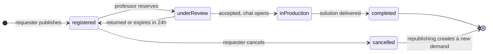
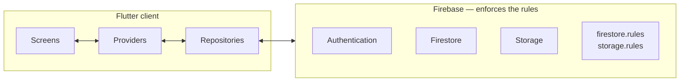

<div align="center">


# Nexus Tech

### The bridge between those with a problem and those who can solve it.

Organisations publish real needs.
Faculty at **IFRS Campus Osório** turn them into academic projects.

<br />

[](https://flutter.dev)
[](https://dart.dev)
[](https://firebase.google.com)


[Português](README.md) · **English**

[Architecture](docs/ARCHITECTURE.en.md) ·
[Operations](docs/OPERATIONS.en.md) ·
[Free and paid plans](docs/CLOUD_FUNCTIONS.en.md)

</div>

> The application interface and source identifiers are in Brazilian Portuguese.
> A glossary of domain terms closes the
> [architecture document](docs/ARCHITECTURE.en.md).

---

## The problem

A professor on campus has the expertise. An organisation down the road has the
need. The two never meet.

Before Nexus Tech, that connection depended on personal contact, a stray
message, or chance — and a good request was lost for never reaching the right
professor. On the other side, extension projects and final dissertations grew
out of topics proposed in class, with no one actually waiting for the result.

**Nexus Tech closes that circuit** and follows it through to delivery:
publication, triage, acceptance, conversation, delivery and moderation — in
real time, in a single application.

---

## How it works

<table>
<tr>
<td align="center" width="25%">

### 📝
**Requester publishes**

Describes the need, the target audience and the expected impact. Attaches
documents.

</td>
<td align="center" width="25%">

### 🔎
**Professor reviews**

Finds it on the public shelf, reserves it for review and decides according to
their field.

</td>
<td align="center" width="25%">

### 💬
**The two converse**

On acceptance, a conversation channel opens automatically between both parties.

</td>
<td align="center" width="25%">

### 🚀
**It becomes a real project**

A dissertation, an extension project, or a partnership with verifiable impact.

</td>
</tr>
</table>

---

## The life cycle of a demand



Every transition is an **atomic operation** validated across three layers: the
state machine in the domain, the transaction in the repository, and the
Firestore Rules on the server. None trusts the previous one.

The most delicate point is **acceptance**: the same transaction that moves the
demand into production creates the conversation document. Without it, the state
"demand accepted, no communication channel" would exist — visible to the user
and impossible for them to resolve.

---

## What the application does

<table>
<tr>
<td valign="top" width="33%">

### 🏢 Requester

- Publish, edit and cancel demands
- Republish a cancelled demand
- Attachments in PDF, DOCX, JPEG and PNG
- Cumulative filters by state and period
- Follow the state in real time
- Converse with the responsible professor
- Notification centre
- Review their own warnings

</td>
<td valign="top" width="33%">

### 🎓 Professor

- Public shelf of demands
- Reserve for review, within a 24 h window
- Accept or return to the shelf
- Record the delivery with attachments
- Converse with the requester
- Report an irregular demand
- Profile with technical and interest areas
- Notification centre

</td>
<td valign="top" width="33%">

### 🛡️ Administrator

- System overview
- Report queue with a counter
- Adjudicate reports and issue an opinion
- Warnings and automatic suspension
- Per-professor metrics
- Activate and deactivate faculty profiles
- Requester management
- Audit trail

</td>
</tr>
</table>

### From report to suspension

```
professor reports  ──▶  administrator queue  ──▶  adjudication
                                                       │
                                          upheld ──────┤
                                                       ▼
                              warning +1  ── 3 warnings ──▶  account suspended
                                    │                              │
                                    └──────▶ notify both parties ◀─┘
```

The warning and the suspension occur within the **same transaction** that
adjudicates the report — never "upheld report without a warning", never a
duplicated warning from repeated activation. And suspension is not cosmetic:
Firestore Rules refuse demand creation from a suspended account, including
outside the application.

The block reaches the **already-open session**: the profile is observed in real
time, so an administrative decision changes the screen without requiring a new
sign-in.

---

## Technologies

<table>
<tr>
<td valign="top" width="33%">

**Application**

Flutter 3.38+
Dart 3.10+
Material 3
Provider — 10 global providers

</td>
<td valign="top" width="33%">

**Backend — Firebase**

Google Authentication
Cloud Firestore, in real time
Cloud Storage, for attachments
Security Rules, on the server

</td>
<td valign="top" width="33%">

**Quality**

92 automated tests
`flutter analyze` with no findings
Living documentation under `docs/`
Audit trail in production

</td>
</tr>
</table>

**No custom server.** Business logic lives in the client and security is
enforced by Firestore Rules and Storage Rules. The trade-off is accepted and
documented — see [Architecture, section 10](docs/ARCHITECTURE.en.md).

---

## Architecture



Four principles, in order of precedence:

| | Principle | In practice |
|:--:|---|---|
| 1 | **Single responsibility per layer** | The interface never reaches Firebase. The repository never decides business rules. |
| 2 | **Defence in depth** | A Dart validator is user experience. A Firestore Rule is security. A Storage Rule is security again. |
| 3 | **Real time where change is expected** | `Stream` for what changes during a session; `Future` for what does not. |
| 4 | **Fail honestly** | A primary operation failing aborts with a message. An audit record failing is tolerated. |

Decisions, trade-offs and the **why** of each in
[**ARCHITECTURE.en.md**](docs/ARCHITECTURE.en.md).

<details>
<summary><b><code>lib/</code> structure</b></summary>

```
lib/
├── main.dart                     Startup and Firebase configuration
├── firebase_options.dart         Generated by FlutterFire
│
├── app/
│   ├── app.dart                  MultiProvider and MaterialApp
│   ├── router.dart               Routing by session, role and blocks
│   └── theme.dart                Material 3 and visual identity
│
├── core/
│   ├── constants/                Institutional domain and business rules
│   ├── exceptions/               AppException and error translator
│   ├── models/                   Usuario · Demanda · Chat · Notificacao · Denuncia
│   ├── providers/                AuthProvider, with a real-time profile
│   ├── repositories/             The only layer touching Firebase
│   ├── services/                 Authentication
│   └── utils/                    Validators and formatters
│
└── features/
    ├── auth/                     Sign-in, role registration, blocked account
    ├── demandas/                 The full life cycle, on both sides
    ├── chat/                     Conversations and messages
    ├── notificacoes/             Notification centre
    ├── perfil/                   Profile and editing
    └── admin/                    Administrative panel
```

**Organising criterion:** whatever a second feature might need goes to `core/`;
the rest stays isolated within its feature.

</details>

---

## Running

```bash
git clone <repository-url> && cd nexus_tech
flutter pub get
flutter run
```

**Prerequisites:** Flutter 3.38+ · Dart 3.10+ · Android SDK 21+ or Xcode 15+

Firebase configuration files are version-tracked: they are public client keys,
and effective security lives in the Rules.

> **On Android, the debug build requires the test environment.** The `debug`
> build type uses `applicationIdSuffix = ".dev"`, and the version-tracked
> production configuration does not declare that package — the
> `google-services` plugin refuses to compile. Set up the test environment as
> described in [OPERATIONS.en.md §2](docs/OPERATIONS.en.md), or drop the suffix
> to build against production. The constraint is deliberate: the pair of
> package identifier and certificate fingerprint is unique across all of Google
> Cloud, and it prevents a debug session from reaching real data by accident.

<details>
<summary><b>Environments, Rules and indexes</b></summary>

The project runs on two Firebase projects. Debug builds point at the test
environment and use their own package suffix, which allows keeping both
versions installed on the same device.

```bash
# publish rules and indexes
firebase deploy --only firestore:rules,firestore:indexes,storage --project prod
firebase deploy --only firestore:rules,firestore:indexes --project dev

# check the environment in use
grep -m1 projectId lib/firebase_options.dart
```

Full procedure — including Authentication, certificate fingerprints and free
tier restrictions — in [**OPERATIONS.en.md**](docs/OPERATIONS.en.md).

</details>

<details>
<summary><b>Verification</b></summary>

```bash
flutter analyze
flutter test
```

</details>

---

## Evolution

| Stage | Scope | State |
|:--:|---|:--:|
| **1** | Authentication, role registration, technical areas | ✅ |
| **2** | Demands and attachments | ✅ |
| **3** | Shelf, acceptance and state transitions | ✅ |
| **4** | Profiles and interface refinement | ✅ |
| **5** | Conversations, notifications, reports, warnings and panel | ✅ |
| **6** | Cloud Functions: push, scheduled return, custom claims | ⏸️ |

The requester ↔ professor cycle is **complete**. Stage 6 adds no functionality:
it **activates external dispatch** of notices the application already produces
internally. The [full catalogue](docs/CLOUD_FUNCTIONS.en.md) describes each item
alongside the extension point already present in the code.

---

## Known limitations

> Recorded for transparency. A project honest about its own limits is more
> trustworthy than one pretending to have none.

| | Limitation |
|:--:|---|
| 🔔 | **There is no external notification — only in-app.** The notification centre is complete and real-time inside the application; a notice while it is closed requires a Cloud Function. Every document is already created awaiting that dispatch. |
| ⏱️ | **The automatic 24 h return is partial.** The demand returns to the shelf when the professor opens their list. If they do not return, it stays held. |
| 🧪 | **Partial test coverage.** 92 tests cover validators, the state machine, metrics and deserialisation. **The Firestore Rules are missing** — the layer where a mistake is silent and severe — along with the three critical transactions. Both require the emulator. |
| 🛡️ | **Attachment verification is superficial.** Extension, MIME type and size only. Content inspection requires a Cloud Function. |
| 🔍 | **Search runs on the client.** Adequate at the scale of a single campus. The professor's shelf is the first point that will require evolution. |
| 🔐 | **A professor sees the full registration data of any requester.** Firestore offers no per-field rule; the solution is separating a public profile from the private document. |
| 👤 | **The administrator list is enumerated in code.** Adding someone requires editing two sources and republishing. Future solution: custom claims. |
| 🤖 | **There is no continuous integration.** `analyze` and `test` depend on manual discipline before each distribution. |

---

## Licence

This project is released under the
**[PolyForm Noncommercial License 1.0.0](LICENSE)**.

<table>
<tr>
<td width="50%" valign="top">

**Permitted**

Use, study and modify
Redistribute and create derivative works
Personal use, research and teaching
Use by educational institutions, public bodies and non-profit organisations

</td>
<td width="50%" valign="top">

**Prohibited**

**Selling this software or charging for it**
Employing it in a commercial product or service
Removing the copyright and licence notices

</td>
</tr>
</table>

The software is provided **without warranty**. For commercial use, contact the
copyright holders. The full and binding text is in [`LICENSE`](LICENSE).

---

## Team

<table>
<tr>
<td align="center" width="33%">

**Development**

**Gustavo Rech Costa**
Scholarship holder — Systems Analysis and Development
IFRS Campus Osório

</td>
<td align="center" width="33%">

**Supervision**

**Prof. Karen Borges**
IFRS Campus Osório

</td>
<td align="center" width="33%">

**Institution**

**Federal Institute of Rio Grande do Sul**
Campus Osório · 2025–2026

</td>
</tr>
</table>

---

## Documentation

| Document | Contents |
|---|---|
| [**ARCHITECTURE.en.md**](docs/ARCHITECTURE.en.md) | Layers, domain, persistence, security, critical flows and decisions |
| [**OPERATIONS.en.md**](docs/OPERATIONS.en.md) | Environments, rule publication, roles, distribution and keys |
| [**CLOUD_FUNCTIONS.en.md**](docs/CLOUD_FUNCTIONS.en.md) | What the free tier does not cover and each item's extension point |

All are also available in Portuguese, without the `.en` suffix.

---

<div align="center">


**Academic Software Factory**
Federal Institute of Rio Grande do Sul — Campus Osório

</div>
