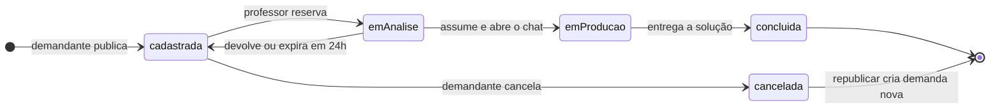
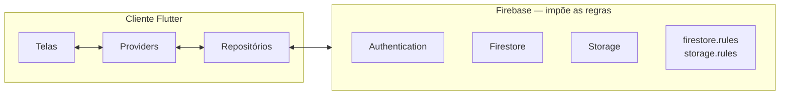

<div align="center">


# Nexus Tech

### A ponte entre quem tem um problema e quem sabe resolver.

Organizações publicam demandas reais.
Professores do **IFRS Campus Osório** as transformam em projetos acadêmicos.

<br />

[](https://flutter.dev)
[](https://dart.dev)
[](https://firebase.google.com)


**Português** · [English](README.en.md)

[Arquitetura](docs/ARCHITECTURE.md) ·
[Operações](docs/OPERATIONS.md) ·
[Plano gratuito e pago](docs/CLOUD_FUNCTIONS.md)

</div>

---

## O problema

Um professor do campus tem a expertise. Uma organização do bairro tem a
necessidade. Os dois nunca se encontram.

Antes do Nexus Tech, essa conexão dependia de contato pessoal, mensagem avulsa
ou acaso — e uma boa demanda se perdia por não alcançar o professor certo. Do
outro lado, projetos de extensão e trabalhos de conclusão nasciam de temas
propostos em sala, sem alguém real aguardando o resultado.

**O Nexus Tech fecha esse circuito** e o acompanha até a entrega: publicação,
triagem, aceite, conversa, entrega e moderação — em tempo real, em uma única
aplicação.

---

## Como funciona

<table>
<tr>
<td align="center" width="25%">

### 📝
**Demandante publica**

Descreve a necessidade, o público-alvo e o impacto esperado. Anexa documentos.

</td>
<td align="center" width="25%">

### 🔎
**Professor avalia**

Encontra na prateleira pública, reserva para análise e decide conforme sua área.

</td>
<td align="center" width="25%">

### 💬
**Os dois conversam**

Ao aceitar, um canal de conversa é aberto automaticamente entre as duas pontas.

</td>
<td align="center" width="25%">

### 🚀
**Vira projeto real**

Trabalho de conclusão, projeto de extensão ou parceria com impacto verificável.

</td>
</tr>
</table>

---

## O ciclo de vida de uma demanda



Cada transição é uma **operação atômica** validada em três camadas: a máquina de
estados no domínio, a transação no repositório e as Firestore Rules no servidor.
Nenhuma confia na anterior.

O ponto mais delicado é o **aceite**: a mesma transação que move a demanda para
produção cria o documento da conversa. Sem isso existiria o estado "demanda
aceita, sem canal de comunicação" — visível ao usuário e impossível de resolver
por ele.

---

## O que a aplicação faz

<table>
<tr>
<td valign="top" width="33%">

### 🏢 Demandante

- Publicar, editar e cancelar demandas
- Republicar uma demanda cancelada
- Anexos em PDF, DOCX, JPEG e PNG
- Filtros acumulativos por estado e período
- Acompanhar o estado em tempo real
- Conversar com o professor responsável
- Central de notificações
- Consultar as próprias advertências

</td>
<td valign="top" width="33%">

### 🎓 Professor

- Prateleira pública de demandas
- Reservar para análise, com prazo de 24 h
- Assumir ou devolver à prateleira
- Registrar a entrega com anexos
- Conversar com o demandante
- Denunciar demanda irregular
- Perfil com áreas técnicas e de interesse
- Central de notificações

</td>
<td valign="top" width="33%">

### 🛡️ Administrador

- Visão geral do sistema
- Fila de denúncias com contador
- Julgar denúncias e emitir parecer
- Advertências e suspensão automática
- Métricas por professor
- Ativar e desativar perfis docentes
- Gestão de demandantes
- Trilha de auditoria

</td>
</tr>
</table>

### Da denúncia à suspensão

```
professor denuncia  ──▶  fila do administrador  ──▶  julgamento
                                                          │
                                          procedente ──────┤
                                                          ▼
                              advertência +1  ── 3 advertências ──▶  conta suspensa
                                      │                                     │
                                      └──────▶ notifica ambas as partes ◀────┘
```

A advertência e a suspensão ocorrem na **mesma transação** que julga a denúncia
— nunca "denúncia procedente sem advertência", nunca advertência duplicada por
acionamento repetido. E a suspensão não é cosmética: as Firestore Rules recusam
a criação de demandas por conta suspensa, inclusive fora da aplicação.

O bloqueio alcança a **sessão já aberta**: o perfil é observado em tempo real,
de modo que uma decisão administrativa troca a tela sem exigir novo acesso.

---

## Tecnologias

<table>
<tr>
<td valign="top" width="33%">

**Aplicação**

Flutter 3.38+
Dart 3.10+
Material 3
Provider — 10 providers globais

</td>
<td valign="top" width="33%">

**Backend — Firebase**

Authentication com Google
Cloud Firestore, em tempo real
Cloud Storage, para anexos
Security Rules, no servidor

</td>
<td valign="top" width="33%">

**Qualidade**

92 testes automatizados
`flutter analyze` sem apontamentos
Documentação viva em `docs/`
Trilha de auditoria em produção

</td>
</tr>
</table>

**Sem servidor próprio.** A lógica de negócio reside no cliente e a segurança é
imposta por Firestore Rules e Storage Rules. O compromisso é assumido e
documentado — ver [Arquitetura, seção 10](docs/ARCHITECTURE.md).

---

## Arquitetura



Quatro princípios, em ordem de precedência:

| | Princípio | Na prática |
|:--:|---|---|
| 1 | **Camadas com responsabilidade única** | A interface nunca acessa o Firebase. O repositório nunca decide regra de negócio. |
| 2 | **Segurança em profundidade** | O validador em Dart é experiência de uso. A Firestore Rule é segurança. A Storage Rule é segurança novamente. |
| 3 | **Tempo real onde se espera mudança** | `Stream` para o que muda durante a sessão; `Future` para o que não muda. |
| 4 | **Falhar com honestidade** | Falha em operação principal aborta com mensagem. Falha em registro de auditoria é tolerada. |

Decisões, compromissos e o **porquê** de cada um em
[**ARCHITECTURE.md**](docs/ARCHITECTURE.md).

<details>
<summary><b>Estrutura de <code>lib/</code></b></summary>

```
lib/
├── main.dart                     Inicialização e configuração do Firebase
├── firebase_options.dart         Gerado pelo FlutterFire
│
├── app/
│   ├── app.dart                  MultiProvider e MaterialApp
│   ├── router.dart               Roteamento por sessão, papel e bloqueios
│   └── theme.dart                Material 3 e identidade visual
│
├── core/
│   ├── constants/                Domínio institucional e regras de negócio
│   ├── exceptions/               AppException e tradutor de erros
│   ├── models/                   Usuario · Demanda · Chat · Notificacao · Denuncia
│   ├── providers/                AuthProvider, com perfil em tempo real
│   ├── repositories/             Única camada que acessa o Firebase
│   ├── services/                 Autenticação
│   └── utils/                    Validadores e formatadores
│
└── features/
    ├── auth/                     Acesso, cadastro por papel e conta bloqueada
    ├── demandas/                 Ciclo de vida completo, nas duas pontas
    ├── chat/                     Conversas e mensagens
    ├── notificacoes/             Central de avisos
    ├── perfil/                   Perfil e edição
    └── admin/                    Painel administrativo
```

**Critério de organização:** o que uma segunda funcionalidade possa precisar vai
para `core/`; o restante permanece isolado na funcionalidade.

</details>

---

## Execução

```bash
git clone <url-do-repositorio> && cd nexus_tech
flutter pub get
flutter run
```

**Pré-requisitos:** Flutter 3.38+ · Dart 3.10+ · Android SDK 21+ ou Xcode 15+

As configurações do Firebase são versionadas: trata-se de chaves públicas de
cliente, e a segurança efetiva reside nas Rules.

> **No Android, o build de depuração exige o ambiente de teste.** O tipo de
> build `debug` usa `applicationIdSuffix = ".dev"`, e a configuração de
> produção versionada não declara esse pacote — o plugin `google-services`
> recusa a compilação. Configure o ambiente de teste conforme
> [OPERATIONS.md §2](docs/OPERATIONS.md), ou remova o sufixo para compilar
> contra produção. A restrição é deliberada: o par identificador de pacote e
> impressão digital é único em todo o Google Cloud, e ela impede que uma
> depuração alcance dados reais por descuido.

<details>
<summary><b>Ambientes, Rules e índices</b></summary>

O projeto opera sobre dois projetos Firebase. Builds de depuração apontam para o
ambiente de teste e usam sufixo de pacote próprio, o que permite manter as duas
versões instaladas no mesmo aparelho.

```bash
# publicar regras e índices
firebase deploy --only firestore:rules,firestore:indexes,storage --project prod
firebase deploy --only firestore:rules,firestore:indexes --project dev

# verificar o ambiente em uso
grep -m1 projectId lib/firebase_options.dart
```

Procedimento completo — incluindo Authentication, impressão digital de
certificado e as restrições do plano gratuito — em
[**OPERATIONS.md**](docs/OPERATIONS.md).

</details>

<details>
<summary><b>Verificação</b></summary>

```bash
flutter analyze
flutter test
```

</details>

---

## Evolução

| Etapa | Escopo | Estado |
|:--:|---|:--:|
| **1** | Autenticação, cadastro por papel, áreas técnicas | ✅ |
| **2** | Demandas e anexos | ✅ |
| **3** | Prateleira, aceite e transições de estado | ✅ |
| **4** | Perfis e refinamento de interface | ✅ |
| **5** | Conversas, notificações, denúncias, advertências e painel | ✅ |
| **6** | Cloud Functions: *push*, devolução agendada, *custom claims* | ⏸️ |

O ciclo demandante ↔ professor está **completo**. A etapa 6 não acrescenta
funcionalidade: ela **ativa o envio externo** de avisos que a aplicação já
produz internamente. O
[catálogo completo](docs/CLOUD_FUNCTIONS.md) descreve cada item com o ponto de
extensão já presente no código.

---

## Limitações conhecidas

> Registradas por transparência. Um projeto honesto quanto aos próprios limites
> é mais confiável do que um que finge não tê-los.

| | Limitação |
|:--:|---|
| 🔔 | **Não há notificação externa — apenas in-app.** A central de avisos é completa e em tempo real dentro da aplicação; o aviso com ela fechada exige Cloud Function. Todo documento já nasce marcado à espera desse despacho. |
| ⏱️ | **A devolução automática em 24 h é parcial.** A demanda retorna à prateleira quando o professor abre sua lista. Se ele não retornar, ela permanece retida. |
| 🧪 | **Cobertura de testes parcial.** 92 testes cobrem validadores, máquina de estados, métricas e desserialização. **Faltam as Firestore Rules** — camada em que um erro é silencioso e grave — e as três transações críticas. Ambos exigem o emulador. |
| 🛡️ | **A verificação de anexos é superficial.** Apenas extensão, tipo MIME e tamanho. Inspeção de conteúdo exige Cloud Function. |
| 🔍 | **A busca é feita no cliente.** Adequada à escala de um campus. A prateleira do professor é o primeiro ponto que exigirá evolução. |
| 🔐 | **O professor acessa dados cadastrais completos de qualquer demandante.** O Firestore não oferece regra por campo; a solução é separar um perfil público do documento privado. |
| 👤 | **A lista de administradores é enumerada em código.** Incluir alguém exige editar duas fontes e republicar. Solução futura: *custom claims*. |
| 🤖 | **Não há integração contínua.** `analyze` e `test` dependem de disciplina manual antes de cada distribuição. |

---

## Licença

Este projeto está sob a
**[PolyForm Noncommercial License 1.0.0](LICENSE)**.

<table>
<tr>
<td width="50%" valign="top">

**Permitido**

Usar, estudar e modificar
Redistribuir e criar trabalhos derivados
Uso pessoal, pesquisa e ensino
Uso por instituições de ensino, órgãos públicos e organizações sem fins lucrativos

</td>
<td width="50%" valign="top">

**Proibido**

**Vender este software ou cobrar por ele**
Empregá-lo em produto ou serviço comercial
Remover os avisos de direitos autorais e de licença

</td>
</tr>
</table>

O software é fornecido **sem garantia**. Para uso comercial, procure os
detentores dos direitos autorais. O texto integral e vinculante está em
[`LICENSE`](LICENSE), acompanhado de resumo em português que **não substitui**
os termos.

---

## Equipe

<table>
<tr>
<td align="center" width="33%">

**Desenvolvimento**

**Gustavo Rech Costa**
Bolsista — Análise e Desenvolvimento de Sistemas
IFRS Campus Osório

</td>
<td align="center" width="33%">

**Orientação**

**Profª Karen Borges**
IFRS Campus Osório

</td>
<td align="center" width="33%">

**Instituição**

**Instituto Federal do Rio Grande do Sul**
Campus Osório · 2025–2026

</td>
</tr>
</table>

---

## Documentação

| Documento | Conteúdo |
|---|---|
| [**ARCHITECTURE.md**](docs/ARCHITECTURE.md) | Camadas, domínio, persistência, segurança, fluxos críticos e decisões |
| [**OPERATIONS.md**](docs/OPERATIONS.md) | Ambientes, publicação de regras, papéis, distribuição e chaves |
| [**CLOUD_FUNCTIONS.md**](docs/CLOUD_FUNCTIONS.md) | O que o plano gratuito não cumpre e o ponto de extensão de cada item |

Todos disponíveis também em inglês, com sufixo `.en.md`.

---

<div align="center">


**Fábrica de Software Acadêmica**
Instituto Federal do Rio Grande do Sul — Campus Osório

</div>
